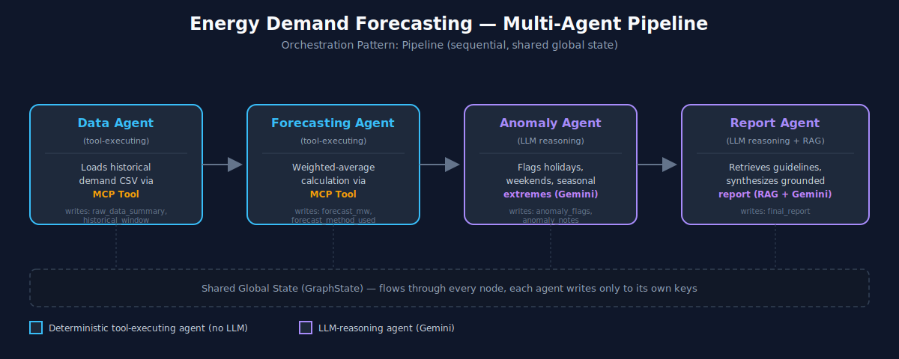
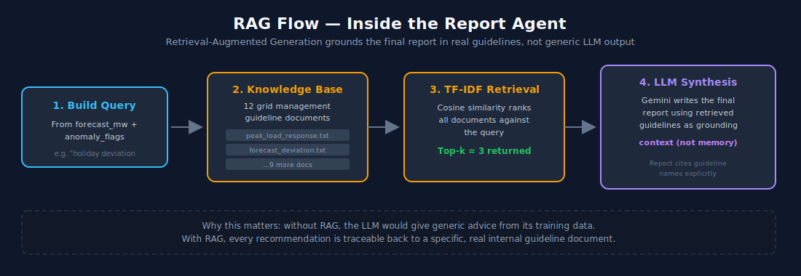
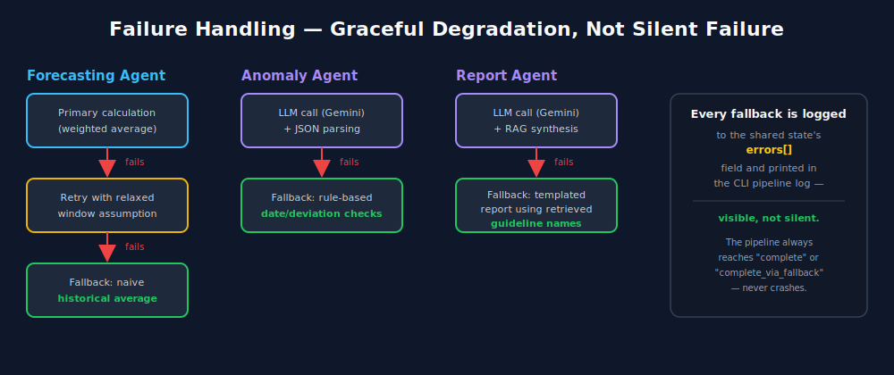
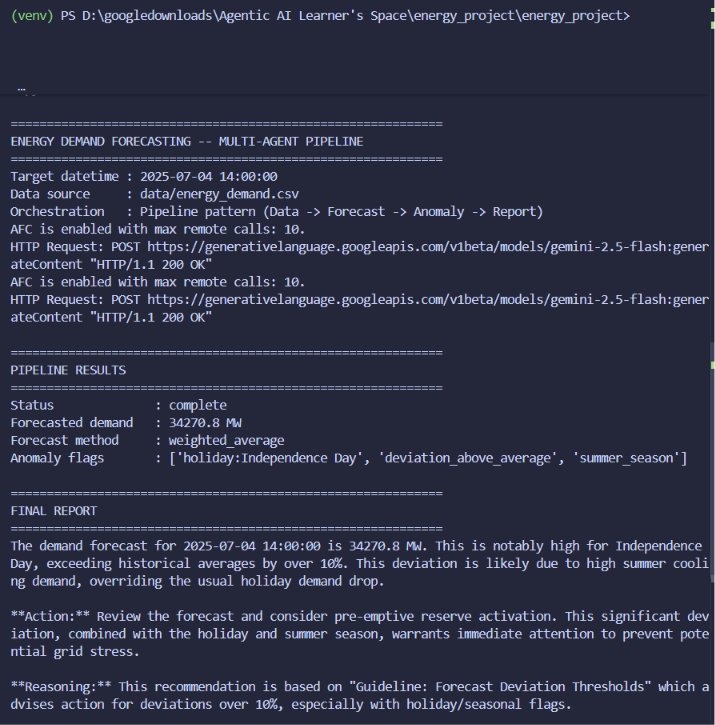

# Energy Demand Forecasting Multi-Agent System

A multi-agent pipeline that forecasts grid energy demand and produces a grounded, plain-English operational report for grid operators — built for the Analytics Club Agentic AI Bootcamp (Learners' Space 2026) Week 4 Capstone.

## Features
This project combines deterministic tools and LLM-based reasoning in a multi-agent pipeline to generate accurate forecasts together with grounded operational recommendations for grid operators.
- Multi-Agent Pipeline using LangGraph
- MCP Tool Integration
- Retrieval-Augmented Generation (RAG)
- Google Gemini LLM
- Shared Global State
- Retry & Fallback Mechanisms
- Grounded Operational Reports

## Problem Statement

Grid operators don't just need a raw demand number — they need to know **why** a forecast is notable and **what to do about it**. A single forecasting model can't do this well: producing an accurate number, judging contextual risk (holidays, seasons, deviations), and writing an actionable recommendation grounded in operational guidelines are three genuinely different jobs.

This project splits those jobs across four specialized agents coordinated through a pipeline, rather than one agent doing everything end-to-end.

## Architecture


### Overall Pipeline Architecture
The system follows a **Pipeline orchestration pattern** implemented using **LangGraph**. Each agent has a well-defined responsibility and passes its output to the next agent through a shared global state.
<p align="center">

</p>

**Figure 1:** Overall multi-agent pipeline architecture.

**Orchestration pattern: Pipeline**
The task is strictly sequential — you can't flag anomalies before a forecast exists, and can't write a report before both the forecast and anomaly context exist. Per the Week 4 orchestration theory, Pipeline is the correct pattern here (Supervisor/dynamic routing would be unnecessary complexity for a linear task).

```
+-------------+     +----------------------+     +-----------------+     +----------------+
|  Data Agent  | --> | Forecasting Agent    | --> | Anomaly Agent    | --> | Report Agent    |
| (tool-based) |     | (tool-based)          |     | (LLM reasoning)  |     | (LLM + RAG)      |
+-------------+     +----------------------+     +-----------------+     +----------------+
```

| Agent | Type | Responsibility |
|---|---|---|
| **Data Agent** | Deterministic, tool-executing | Loads historical demand data, extracts relevant windows via an MCP tool |
| **Forecasting Agent** | Deterministic, tool-executing | Computes a weighted-average demand forecast via an MCP tool; retries/falls back if data is insufficient |
| **Anomaly/Context Agent** | LLM-reasoning | Judges whether the target date/forecast is contextually notable (holiday, weekend, seasonal extreme, large deviation) |
| **Report Agent** | LLM-reasoning + RAG | Retrieves relevant internal grid guidelines and synthesizes a grounded, actionable report |

### RAG Retrieval Flow
The Report Agent retrieves the most relevant operational guidelines from the internal knowledge base before generating the final grounded report. This ensures that recommendations are based on documented policies rather than relying solely on the language model.
<p align="center">

</p>

**Figure 2:** Retrieval-Augmented Generation workflow inside the Report Agent.

### State Management

Shared global state (see `state/graph_state.py`), per the Week 4 rule of thumb ("start with shared global state for pipeline patterns"). Each agent only writes to its own designated keys, so agents never overwrite each other's work:

- Data Agent -> `raw_data_summary`, `historical_window`
- Forecasting Agent -> `forecast_mw`, `forecast_method_used`
- Anomaly Agent -> `anomaly_flags`, `anomaly_notes`
- Report Agent -> `final_report`
- All agents may append to `errors` for failure tracking

### Failure Handling

The pipeline is designed to degrade gracefully...

<p align="center">

</p>

**Figure 3:** Retry and fallback mechanism across the pipeline.

Three mechanisms are implemented (Week 4 required at least one):

1. **Retry**: Forecasting Agent retries with a relaxed data requirement if the primary calculation window is empty.
2. **Fallback**: If retry still fails, Forecasting Agent falls back to a naive historical average instead of crashing. Anomaly Agent falls back to rule-based date/deviation checks if the LLM call fails. Report Agent falls back to a templated report using retrieved guideline names if the LLM call fails.
3. **Graceful degradation over silent failure**: every fallback is logged to `errors` in the shared state and printed in the CLI output, so failures are visible, not silent.

This was validated during development: running the pipeline without an API key configured triggered the Anomaly and Report Agent fallbacks in a real (not simulated) failure, while Data and Forecasting Agents completed normally -- proving the pipeline degrades gracefully rather than crashing end-to-end.

## Why Multi-Agent (not a single agent with extra steps)

- The Data/Forecasting agents are **deterministic tool-executors** -- they should not involve LLM reasoning, since precise numeric calculation is not an LLM strength.
- The Anomaly/Report agents are **LLM-reasoning agents** -- contextual judgment and grounded natural-language synthesis are exactly where LLMs add value.
- Mixing both types in one agent would either waste LLM calls on deterministic work, or lose the benefit of independent reasoning steps (e.g. the Report Agent's RAG grounding depends on the Anomaly Agent's flags already being decided).

## Tech Stack (mapped to bootcamp weeks)

| Component | Week | Tool |
|---|---|---|
| LLM prompting & API calls | Week 1 | Google Gemini API via `langchain-google-genai` (free tier) |
| RAG | Week 2 | TF-IDF + cosine similarity retrieval over a custom knowledge base (`rag/retriever.py`) |
| MCP tools | Week 3 | `mcp` (FastMCP) -- `mcp_tools/data_tool.py`, `mcp_tools/forecast_tool.py` |
| LangGraph orchestration | Week 3/4 | `langgraph.StateGraph` -- `graph.py` |
| Multi-agent orchestration pattern | Week 4 | Pipeline pattern, shared global state, failure handling |

## Project Structure

```
energy_project/
|-- data/energy_demand.csv       # synthetic 2-year hourly grid demand dataset
|-- generate_data.py             # script used to generate the dataset
|-- mcp_tools/
|   |-- data_tool.py              # MCP tool: loads/filters historical data
|   |-- forecast_tool.py          # MCP tool: weighted-average forecast + naive fallback
|-- agents/
|   |-- data_agent.py
|   |-- forecasting_agent.py
|   |-- anomaly_agent.py
|   |-- report_agent.py
|-- rag/
|   |-- retriever.py               # TF-IDF retrieval over the knowledge base
|   |-- knowledge_base/            # 12 grid management guideline documents
|-- state/graph_state.py          # shared state schema (TypedDict)
|-- graph.py                       # LangGraph StateGraph pipeline wiring
|-- main.py                        # CLI entry point
|-- requirements.txt
|-- .env.example
```

## Setup

```bash
git clone <your-repo-url>
cd energy_project
pip install -r requirements.txt
cp .env.example .env

```

## Usage

```bash
# Forecast for 24 hours from now
python main.py

# Forecast for a specific date/time
python main.py --datetime "2026-01-15 18:00:00"

# Use a different dataset
python main.py --datetime "2026-07-04 14:00:00" --data-path data/energy_demand.csv
```

## Example Output

### Pipeline Demo



```
============================================================
ENERGY DEMAND FORECASTING -- MULTI-AGENT PIPELINE
============================================================
Target datetime : 2025-12-25 19:00:00
Data source     : data/energy_demand.csv
Orchestration   : Pipeline pattern (Data -> Forecast -> Anomaly -> Report)

============================================================
PIPELINE RESULTS
============================================================
Status              : complete
Forecasted demand   : 31730.0 MW
Forecast method     : weighted_average
Anomaly flags       : ['holiday:Christmas Day', 'winter_season']

============================================================
FINAL REPORT
============================================================
Forecast for Dec 25, 2025, 7:00 PM: 31,730 MW. This is Christmas Day, a
recognized holiday, during winter heating season. Winter holiday demand
combines lower commercial load with residential heating/evening
occupancy spikes (Guideline: Holiday Demand Patterns). Winter deviations
warrant closer monitoring than other seasons since spikes can escalate
quickly (Guideline: Winter Heating Demand). Recommended action: maintain
standard reserve margin, shift reserve capacity toward residential
feeders for the evening window, and monitor for rapid escalation.
```

*(Above shows expected output with a valid API key. Without one, the pipeline still completes via its fallback paths -- see `errors` in the pipeline log.)*

## Regenerating the Dataset

The demand dataset is synthetic but structurally realistic (daily/weekly/yearly seasonality, holiday dips, noise), modeled after public datasets like PJM Hourly Energy Consumption. Regenerate it anytime with:

```bash
python generate_data.py
```

## Contest Submission

- **Problem originality & relevance**: energy grid demand forecasting with contextual, guideline-grounded reporting
- **Technical execution**: MCP tools, LangGraph pipeline, RAG retrieval, retry/fallback failure handling
- **Orchestration design**: Pipeline pattern with shared global state, justified by task structure
- **Clarity & presentation**: this README + inline code documentation
